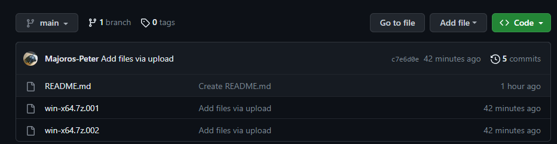
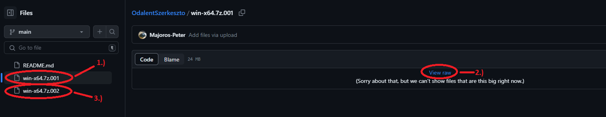
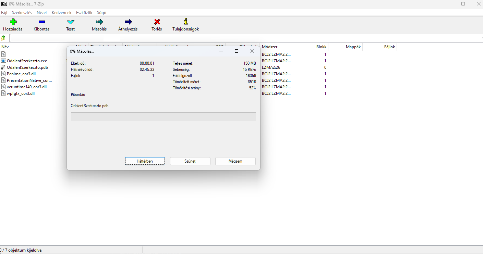
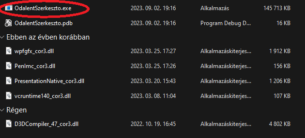

# Program részei:
>#### Hős kártya készítő: ❌
>#### Tárgy kártya készítő: ❌
>#### Szörny kártya készítő: ✔️
>#### Mesélő kártya készítő: ❌
>#### Képesség kártya készítő: ❌
# Technikai dolgok:
>### A Program **WPF**-ben lett írva **.NET 6.0** framework-öt használja, de nem szükséges feltelepíteni, mert már benne van az OdalentSzerkesztő.exe-ben.
>### **7-zip**-el lett tömörítve, de kicsomagolni csak a ***win-x64.7z.001*** fájlt kell.
# Letöltés:
>### Kattints a **win-x64.7z.001** fájlra
> 
> 
>### Kattints a **view raw**-ra, majd kattints bal oldalon a másik fájlra, és megint a view raw-ra
> 
> 
>### Csomagold ki **7-zip**-el egy mappába.
> 
>
>### A programot pedig az **OdalentSzerkesztő.exe**-vel lehet futtatni.
> 
